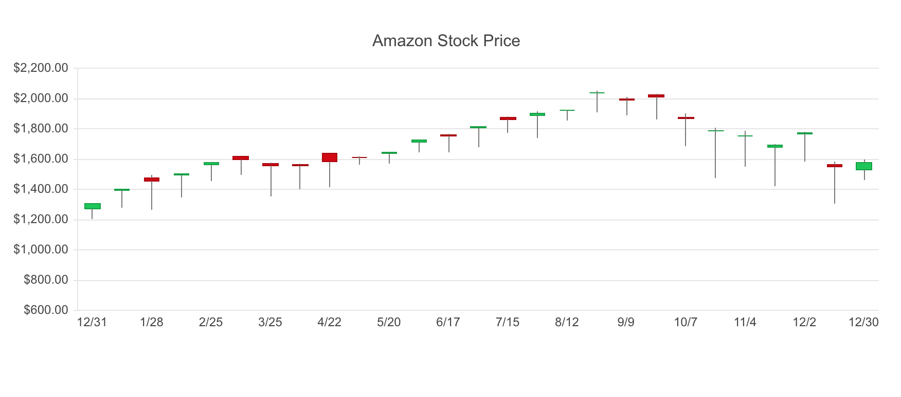

# Kendo UI StockChart for Vue

## Overview

The KendoUI StockChart component is a candlestick chart that visualizes stock data. A candlestick shows the open, high, low, and close values for a stock. It has a solid portion that is the body and two wicks extending above and below the body. The body shows the range between the open and close price. The top of the upper wick represents the highest trading price. The bottom of the lower wick is the lowest trading price. Candlestick charts are used to analyze patterns in price movements such as upward trends and downward trends. This demo shows a stock chart for Amazon stock.

## Example



## Getting Started

See the following tutorial for instructions on basic usage:

[How to Use a Vue Stock Chart UI Component in Your Web App](https://www.telerik.com/blogs/how-to-use-a-vue-stock-chart-ui-component-in-your-web-app)

## Build Setup

``` bash
# install dependencies
npm install

# serve with hot reload at localhost:8080
npm run dev

# build for production with minification
npm run build
```
